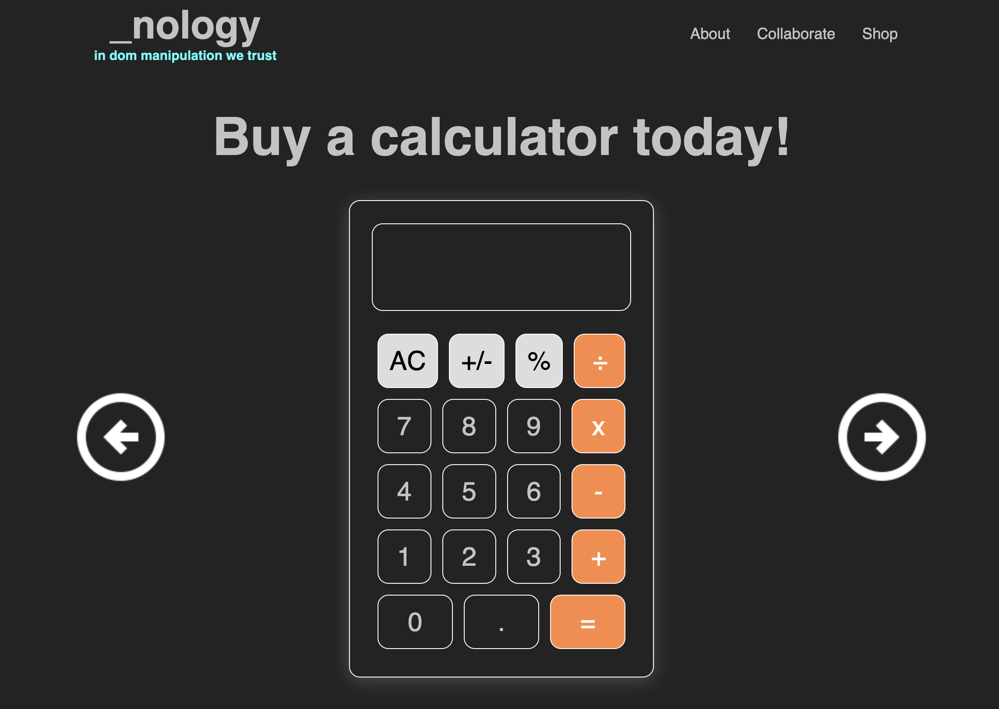
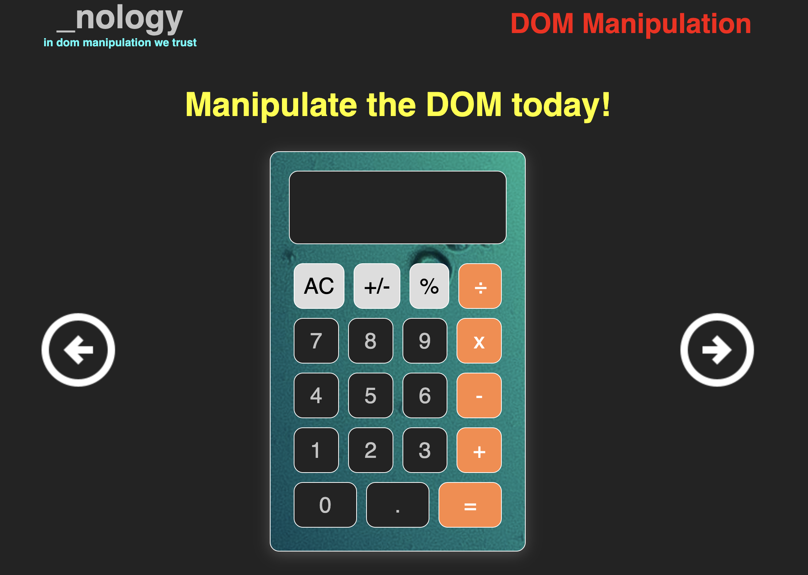

## _nology
`the calculator project`

## Design > Develop > Manipulate
- The iphone calculator was chosen as my template 
- HTML was used to outline and name all the key parts needed to build the actual calculator.
- CSS Flexbox was used to make the calculator look like a calculator and media query was used to add responsiveness for all screen sizes.
- Javascript brought our calculator display to life and it also allowed us to highlight some of the ways we can manipulate the DOM.

## Manipulat the dom today!
* [Live Demo](https://jessebubble.github.io/nology-calculator/)

